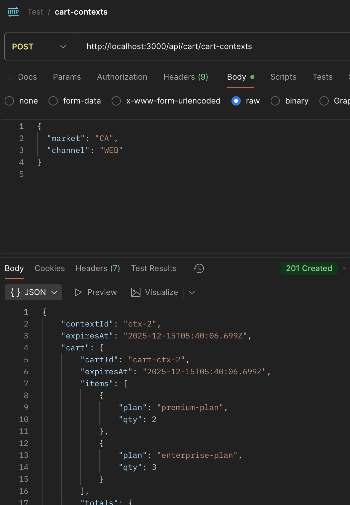
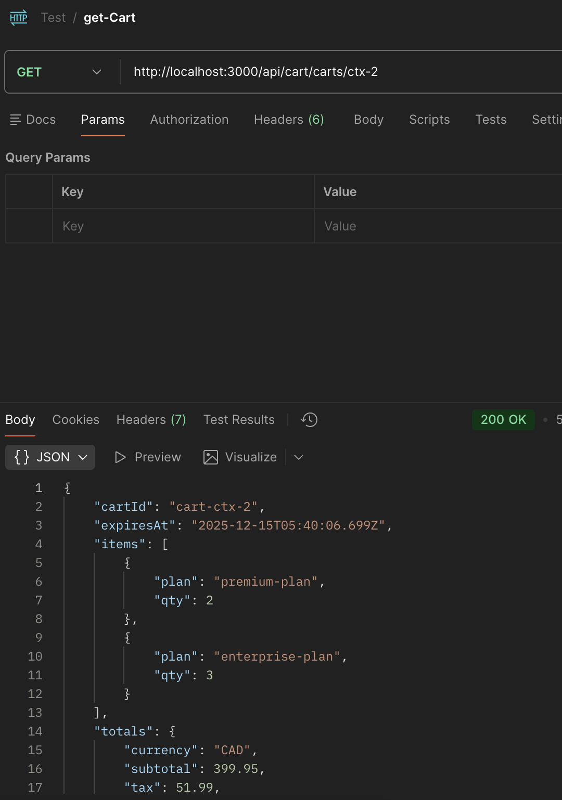
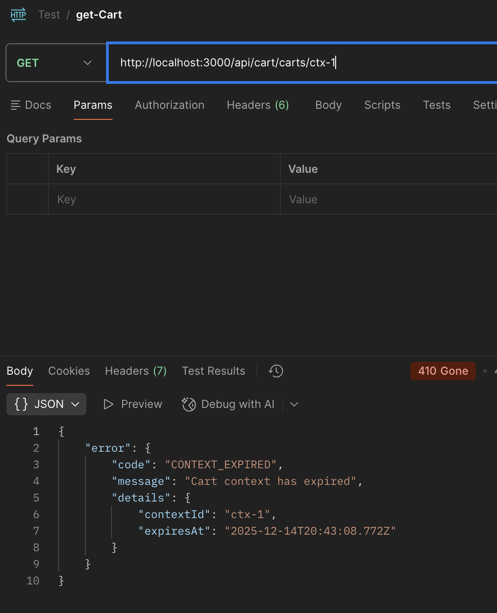

# Telecom Cart Experience API

A cart API with two endpoints and expiring contexts.

## What it does

Creates cart contexts. Each context expires after 15 minutes. You can create contexts and fetch carts until they expire.

## What this shows

How to separate HTTP concerns from business logic from upstream behavior. Each layer has clear responsibilities:

- HTTP routes handle requests and turn errors into status codes
- CartService holds the business rules (one place, not scattered)
- UpstreamClient abstracts the external cart system
- ContextStore tracks when things expire

Errors have consistent shapes across all endpoints. Expiry is checked before calling upstream. Tests use real objects instead of heavy mocking.

## Running it

```bash
npm install
npm start
```

Runs on port 3000.

## Example usage

**Create a context:**
```bash
curl -X POST http://localhost:3000/api/cart/cart-contexts \
  -H "Content-Type: application/json" \
  -d '{"market": "CA", "channel": "web"}'
```

Returns:
```json
{
  "contextId": "ctx-1",
  "expiresAt": "2025-01-15T10:30:00.000Z",
  "cart": {
    "cartId": "cart-ctx-1",
    "items": [{"plan": "premium-plan", "qty": 2}],
    "totals": {"currency": "CAD", "subtotal": 99.98, "tax": 12.99, "total": 112.97}
  }
}
```

**Postman Screenshot**


**Fetch the cart:**
```bash
curl http://localhost:3000/api/cart/carts/ctx-1
```

**Postman Screenshot**


**What errors look like:**
- 400 when required fields are missing
- 404 when context doesn't exist
- 410 when context expired

All errors return `{"error": {"code": "...", "message": "...", "details": {...}}}`

**Postman Screenshot**


## Tests

```bash
npm test
```

Tests cover the mock client, service layer, HTTP routes, and storage. They use fake timers to test expiry without waiting.

## Decisions and trade-offs

**Why CartService calls ContextStore before upstream:**
Fail fast on expired contexts instead of making unnecessary upstream calls.

**Why the mock client generates deterministic carts:**
Same contextId always returns the same cart. Tests don't flake.

**Why logging only happens in the HTTP layer:**
Business logic stays testable without worrying about log output. Errors flow up to the boundary.

**Why in-memory storage:**
Simpler to run and test. Real apps would use Redis or similar.

**Why no background jobs:**
Expiry is checked on read, not cleaned up proactively. Keeps it simple. Real systems might expire contexts in background.

## Known gaps and non-goals

**Not included:**
- Authentication or authorization
- Database persistence
- Rate limiting
- Metrics beyond basic logging
- Real Salesforce integration (uses a mock)
- Background cleanup of expired contexts

**Why:**
This is about structure and separation of concerns, not feature completeness. Adding auth or a database doesn't change how layers talk to each other.

## Project structure

```
src/
├── routes/          # Request validation, error mapping to HTTP
├── services/        # Business rules for context and cart operations
├── clients/         # Mock upstream (deterministic behavior)
├── stores/          # In-memory context tracking
├── types/           # Shared types and error definitions
└── utils/           # Simple logger (console.log/error)

tests/
├── clients/         # Mock client tests
├── services/        # Business logic tests
├── routes/          # HTTP endpoint tests
└── stores/          # Storage tests
```

Files to read:
- `SPEC-A-architecture.md` - why things are where they are
- `SPEC-B-http-api.md` - endpoint contracts
